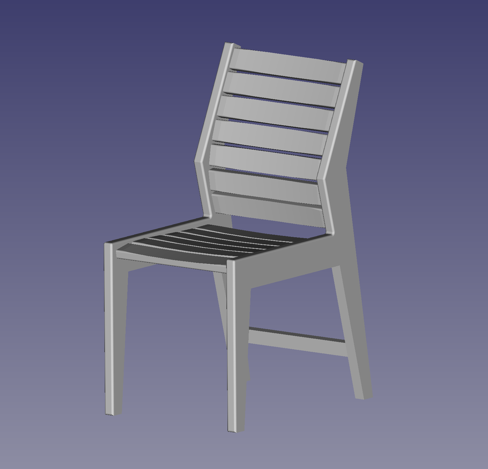

# It's a chair

Here's an attempt at making a chair 1. out of wood 2. with some sort of lumbar support.

Plans are available as PDF. The template is true-scale: make sure your printer does not re-scale it again so you can tape it directly onto your piece.

My friend Ryan Makes [3D-printed the chair for a cute sculpture](https://fosstodon.org/@ryancoordinator/111546860495256611).

# License

[CC-BY-SA](https://creativecommons.org/licenses/by-sa/4.0/)
