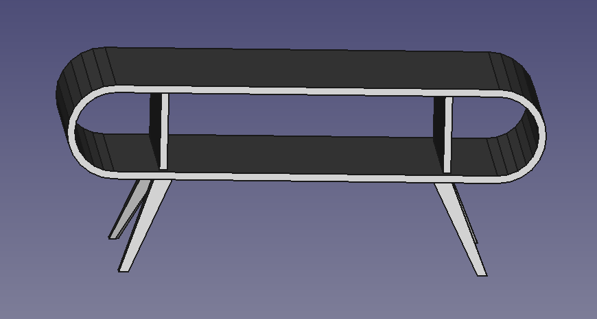

# A retro-modern coffee table

The real-life implementation added stretchers across all the blocks to strengthen the structure. The legs are indicative and are not implemented strictly. The interesting bit really is at what angle to cut the blocks to make the round sides.

# License

[CC-BY-SA](https://creativecommons.org/licenses/by-sa/4.0/)
