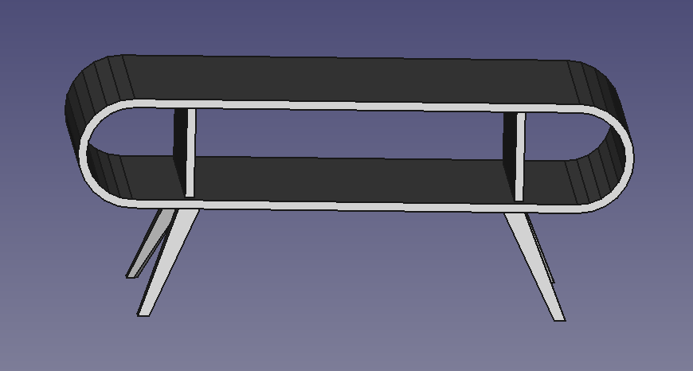
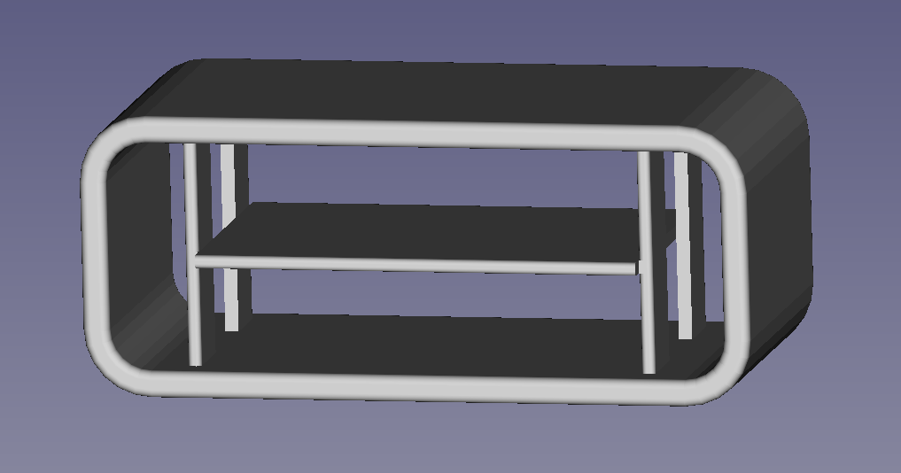
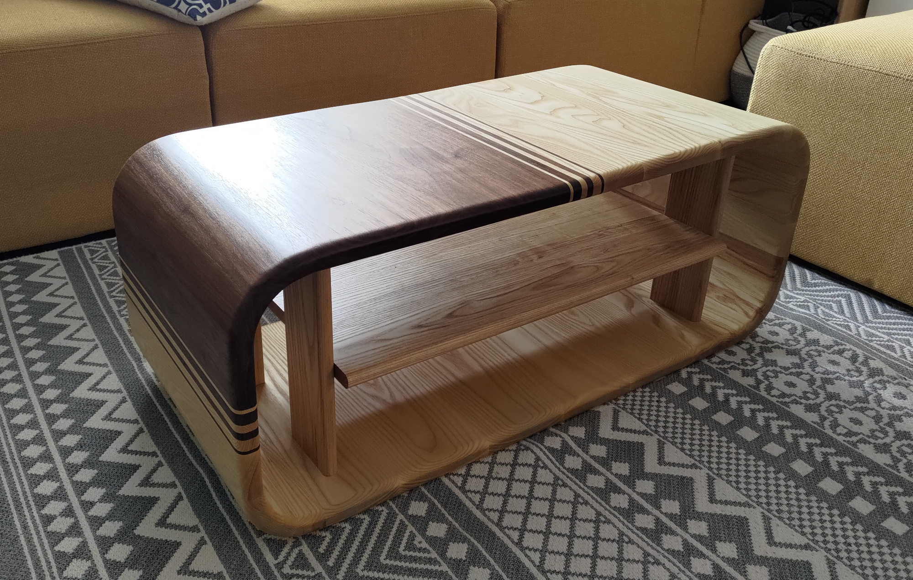
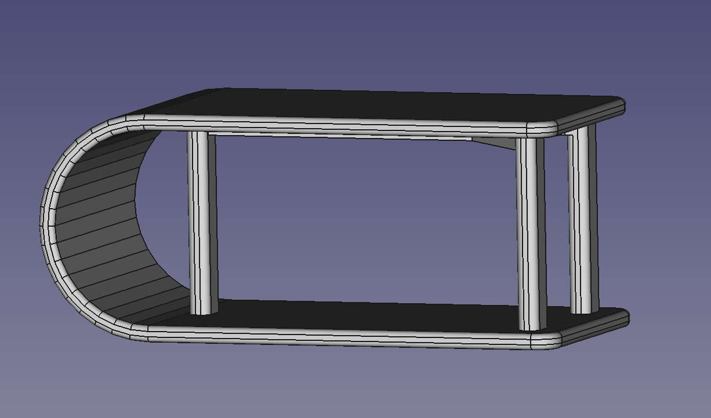

# Some coffee tables

I played around with round corners made of mitered wood section. The implementation is especially challenging. First, glueing-up the round corners is not easy, as they can't really be clamped. Second, it involves a crap ton of sanding, especially inside the corners (the outside can be knocked on quickly with a spokeshave) to make them smooth and somehow hide the flat sections. Finally, it's very hard to be precise both in the overall angles of the corners (e.g.: for the first table, the corner should form an overall angle of 180° -- in real life it's usually off) which makes the final glue-up a time consuming and stressful experience.

A few tips:
- I build all the corners separately, and glue them using masking tape: I put all the pieces flat, outside-side up, put a lot of blue tape to hold them together, flip the entire thing, put glue in the gaps and fold it back, using the blue-tape as support to hold the piece together while the blue dries. The "clamping" is loosely done by using more blue tape to keep everything tight. Needless to say, the clamping force is inadequate to guarantee a strong joint, but it does not necessarily matter much since the overall shape is weak anyway, hence the need for inner support. The priority in this glue-up is to avoid having gaps in between each pieces. Clean the inner side of the corner before the glue dries, to save yourself hours of sanding.
- I glued the flat parts separately.
- I shaved a block of scrap wood with the proper inner radius and use it as support to sand the inner corner. It still takes forever, and I don't have any power tool in my arsenal that could help me with this. This is very, very time consuming.
- When putting everything together, make sure you use the inner side of everything as reference. It doesn't matter if the outside does not line up perfectly, because it's easy to correct. Any mismatch inside means a lot of sanding.
- When putting everything together, I used ratchet straps to push everything together. It's a good idea to add some cauls to prevent the flat part from buckling.
- Because the wood is glued perpendicular to the grain, nothing is very robust here. Add inner support in the form of stretchers along the flat surface, and columns to make sure the corners won't collapse.

Each table comes with the FreeCAD sources (weekly version), a PDF file for the tech drawing and an STL version for 3D printing.

## Bendy

The real-life implementation added stretchers across all the blocks to strengthen the structure. The legs are indicative and are not implemented strictly.

## Bendy 2

## Warped

(no real life implementation of this one yet)

# License

[CC-BY-SA](https://creativecommons.org/licenses/by-sa/4.0/)
